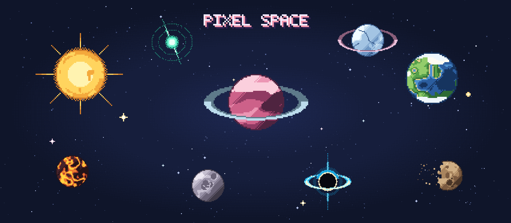

<div align="center">

# ✦ pixel space ✦

**roll a planet · mutate it · share its seed**

<br/>

[](LICENSE)
[](https://react.dev)
[](https://www.typescriptlang.org)
[](https://vitejs.dev)
[](#-how-a-world-fits-in-7-characters)

<br/>

_A little generative toy that draws retro pixel-art planets, stars, and the occasional stranger thing._
_Worlds are deterministic, so the same seven characters always give you back the same sky._

</div>

<br/>

## ✦ what is it

Two buttons. **Generate** rolls a new world; **mutate** nudges the current one so you land on a cousin rather than a stranger.

A **world / cosmos** toggle switches the view between your planet alone and a wider sky with a few neighbours, recoloured to match its palette so the scene hangs together.

The **seed** panel shows the current seed and its traits, with a box to type your own. Any text works — `banana`, your name — it just gets hashed into a world. Same seed, same pixels.

<br/>

## ✦ the worlds

Eight body types, each with its own set of eight colour ramps to pull from:

|     | type                                                      |     | type                                                                |
| --- | --------------------------------------------------------- | --- | ------------------------------------------------------------------- |
| 🪐  | **gas giant** — banded atmosphere, storm spots            | ☀️  | **star** — radiant corona, directional rays                         |
| 🌍  | **terran world** — oceans, continents, clouds, polar caps | 💫  | **neutron star** — pulsar jets and pulse rings                      |
| 🧊  | **ice world** — frozen crust, cracked fault lines         | 🕳️  | **black hole** — tilted accretion disks, lensed light, feeding jets |
| 🌑  | **moon** — cratered grey rock                             | 🌋  | **magma core** — lava veins through dark crust                      |

Any of them can also pick up **rings** (one or two, varied tilt), a small **companion star**, or a **deteriorating crust** that crumbles and sheds debris.

<br/>

## ✦ how a world fits in 7 characters

No asset library — the seed is the whole picture, 33 bits packed into seven base36 characters:

```
        1 v x i 3 8 0          ← the big pink gas giant up top
        └─────┬─────┘
        33 bits of world DNA

  ┌──────┬─────────┬──────┬───────┬──────┬─────────┬───────┬─────────┬─────────┐
  │ type │ palette │ size │ rings │ tilt │ buddy ★ │ decay │ feature │  noise  │
  │  3b  │   3b    │  3b  │  2b   │  2b  │   1b    │  1b   │   2b    │   16b   │
  └──────┴─────────┴──────┴───────┴──────┴─────────┴───────┴─────────┴─────────┘
```

The 16-bit `noise` field drives the surface — continents, craters, cracks, storms. Mutation mostly flips a few of those bits and occasionally pokes another field, which is why a mutant reads as a sibling.

The renderer in [`src/gen/render.ts`](src/gen/render.ts) has no dependencies: a seeded PRNG, some value noise, and pixels on a 96×96 canvas. The same file draws the app, the gallery, and the hero image above.

<br/>

## ✦ quickstart

```sh
git clone https://github.com/jdmnk/pixel-space.git
cd pixel-space
npm install
npm run dev     # → http://localhost:5173
```

No keys, no backend, nothing to configure.

| command         |                                                 |
| --------------- | ----------------------------------------------- |
| `npm run dev`   | start the toy                                   |
| `npm run build` | production build into `dist/`                   |
| `npm run hero`  | rebuild the hero and social card from set seeds |

> Add `?gallery` to the URL for a grid of 48 random worlds.

<br/>

## ✦ try these seeds

The worlds from the hero image — drop any into the seed box:

|   seed    | world                                 |
| :-------: | ------------------------------------- |
| `1vxi380` | 🪐 the big pink ringed gas giant      |
| `15lnedd` | 🌍 terran world with a companion star |
| `0guy9ad` | ☀️ the radiant star                   |
| `3oqju3a` | 💫 neutron star with polar jets       |
| `2j4ukhu` | 🧊 ringed ice world                   |
| `0qpi6a7` | 🕳️ feeding black hole with jets       |
| `0jpejuz` | 🌑 crumbling moon                     |

<br/>

## ✦ contributing

Broken render or an idea for a new world? Open an issue or a PR. A few notes:

- keep `render.ts` dependency-free
- new body type: add a renderer to the `switch` in `render.ts` and a name in `TYPE_NAMES` in `seed.ts`
- colour ramps live at the top of `render.ts` — a good first contribution

Don't worry about every world being pretty. Plenty aren't, and that's half the fun.

<br/>

## ✦ license

[MIT](LICENSE). Fork it, ship it, remix it, whatever you like.

<br/>

<div align="center">

<sub>made with ✦ and too many pastel colours</sub>

</div>
